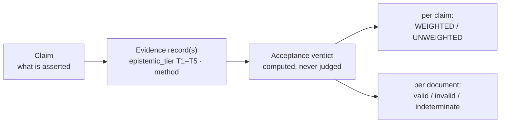
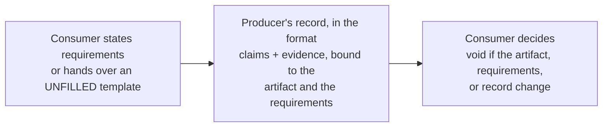
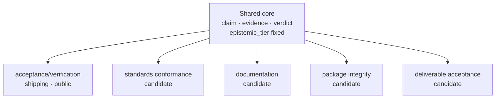

# acceptance-format

an artifact should come with extra info that's needed by the consumer to accept it, not just the
artifact itself. the acceptance format is the glue for that: a contract, formalized as far as it can
be, between the producer of an artifact and its consumer (who may be same as producer) on what was
produced and whatever the consumer has to accept about it — what it does, how well it was verified,
and so on — with the evidence shipped alongside so the consumer can check for itself.

For example, suppose the artifact is a software library — say, a DER codec: the code that encodes
and decodes the binary format many certificates and network protocols are written in. One person
writes it; another wants to use it in their own system. What does that consumer need to know before
accepting it? What it actually does — which parts of the standard it implements, and how it behaves
on malformed input; since that standard is public and written down, the record can name the exact
sections the library supports and, next to each, the proof that it holds. How well each was checked
— spot-tested on a few cases, or proven to hold on every input the code accepts. And what was not
covered at all, said out loud rather than left for them to find. The acceptance format is where the
producer writes all of this down alongside the code, in a form the consumer can re-run and check
instead of taking it on trust — today through one profile, verification; others are named for later.

**This repository ships the acceptance format, checkable by the acceptor's own tooling and
indifferent to whether a person or a model produced the artifact.** A producer ships an artifact plus
a claim about it; an acceptor runs the claim's own recipe and decides, rather than taking the
producer's word for it. Verification is the first concrete meaning this has been given, not the only
one it is built for — see "Format and protocol" and "Profiles", below.

> **Status: `0.1.0-draft`, living, not yet frozen.** One profile, `acceptance/verification` (schema
> `0.2.0-draft`), is public and in use. The profile-neutral core is written into the spec
> (`spec/core.md`, `spec/evidence-types.md`) but not yet extracted into its own artifact, and no
> second profile is in use. The shipped samples exercise the draft; they are not stable tooling
> targets. (Versions are separate: the format spec is `0.1.0-draft`; the verification profile and
> its generated JSON Schema are versioned independently, at `0.2.0-draft`.)

This README follows [arc42](https://arc42.org) headings (§1–§12), adapted for a spec repo with no
deployed system: §6/§7 read as *how validation runs*.

## The general core



Underneath any one profile the spec states a profile-neutral core: a **claim** (what is asserted,
`spec/core.md` §0.5), the **evidence** that backs it (`[[claim.evidence]]` records,
`spec/evidence-types.md`), and an **acceptance verdict** the validator computes mechanically from
the two, never as a private judgment: per claim, WEIGHTED or UNWEIGHTED (`spec/core.md` §0); per
document, `valid` / `invalid` / `indeterminate` (ADR-005, §6 below).

Every evidence record carries an `epistemic_tier`: a closed, artifact-agnostic axis from `T1`
(deductive, kernel-checked derivation) down to `T5` (human judgment), fixed by the core and not
something any profile may redefine (`spec/evidence-types.md`, "Epistemic tier"; the field is
required at freeze and transitional in this draft — its omission warns rather than fails). `method` is the
open token naming the technique that produced the record (`kani-harness`, `lean-theorem`, … under
the verification profile; a different vocabulary under a different one), capped against
`epistemic_tier` by that profile's own `method → epistemic_tier` table. The tier travels unchanged
between profiles; `method` is what each profile fills in for its own domain.

## Format and protocol



The format is the producer's record: one document of claims and the evidence behind them, about an
artifact. The protocol is what that record becomes once a second party has to accept it: the
consumer states its requirements, the producer delivers the record bound to them, and the consumer
decides — a decision that is void if the artifact, the requirements, or the record change. The
format is one part of the protocol; the protocol formalizes its use. This repository ships the
format and the verification profile today; the protocol layer is **not shipped here** — it is named,
and sketched below, only so its shape is legible.

In that protocol the relation is meant to run in either direction: a consumer — a reviewer, a
standards body, a client — would hand the producer an **UNFILLED template** (the claim slots
present, the evidence slots empty) to be returned filled in and re-checkable. That handoff, and the
contract/decision flow in the diagram above, belong to the protocol layer, not to what ships today.

## Profiles



A **profile** is a closed vocabulary plus required fields, constraints, a version id, and at least
one conformance example that validates and one that fails (`spec/format.md` "Profiles";
[`profiles/verification/PROFILE.md`](profiles/verification/PROFILE.md) is the one 0.2 ships).

| profile | glues | status |
|---|---|---|
| `acceptance/verification` | code claims to supporting proofs, model-checking results, and tests, including unit tests | **in use; public** — schema `0.2.0-draft` |
| standards conformance | an artifact to the applicable clauses of a versioned standard, with explicit coverage and exclusions | candidate — next |
| documentation | statements in documentation to the code and behavior they describe | candidate |
| package integrity | package contents and build provenance to a declared manifest and packaging requirements | candidate |
| deliverable acceptance | a delivered artifact to the scope and acceptance criteria of an identified order | candidate |

Only the first row exists in this repository today; the rest are named so the shape of the core is
legible before a second profile is built (see "Status and scope note", below). These are provisional
domain boundaries, not a settled taxonomy: a profile is distinguished by the required fields and
constraints it adds, not merely by its subject (a package is also a deliverable) — and "a claim is
an obligation, discharged by its evidence" is the shape of the core itself, not one domain among these.

## The rules every profile is held to

1. **Stochastic producers propose; deterministic checkers decide.** The validator refuses weight to
   a claim class it cannot fully express and mechanically decide (`spec/core.md` §0); it never
   rejects the claim itself.
2. **A green result is not trusted until its own negative control has been watched failing.** Every
   weighted claim whose grade asserts a check was performed must carry a `watched_fail` witness — a
   producer's record that the recipe was observed reporting the claim false at least once
   (`spec/core.md` §4.1). The validator checks that the witness is present and well-formed, not that
   the failure truly happened (§11) — that stays a reviewer's job.
3. **Weight is refused, not inflated.** A claim that cannot meet a weighted obligation is admitted
   unweighted, never deleted and never rounded up; `ungraded` is one honest word, not a guess
   (`spec/core.md` §1, §8).
4. **Assumptions and gaps stay inside the artifact**, as fields: `[[claim.assumes]]` records a typed
   assumption with a `void_if` trigger (`spec/core.md` §0.5 — recorded as a field; the
   void-not-discount invariant is stated but enforced by no engine in this revision), and
   `not-covered` / `out-of-scope` / `gap` are first-class rows rather than a footnote — though the
   format cannot check that a producer enumerated *every* applicable requirement (§11) (`spec/core.md` §1).
5. **A record must be consumable by tooling the producer does not control**: a plain TOML file, a
   generated JSON Schema (`schema/*.schema.json`), a runnable `self_verify` recipe, and
   domain-separated content hashes (M11, `spec/format.md`).
6. **Nothing here is published before it is in use.** The one shipped profile exists because real
   verification work depends on it (see "Adopters", below); a candidate profile stays a candidate
   until the same is true of it.

## What is deliberately not here

- **How the work behind a claim is reviewed and calibrated.** The format records what a checker
  decided, not how a reviewer is chosen or how reviewers' disagreement is weighed;
  `judgment`-family evidence is declared-null for trust until a measured calibration exists
  (`spec/evidence-types.md`, "The `judgment` family rule").
- **Repository configuration.** The spec and validator are patterns; the values any one producer
  runs them with are not part of the contract.

## 1. Introduction & goals

Three words for three layers: a **manifest** is the TOML source of truth (`acceptance.toml`); a
**ledger** is its rendered table, one row per specification rule; an **envelope** is the legacy
Markdown document that bundles a ledger with witness/identity metadata
(`examples/rs-verified-der/ENVELOPE.md` is one). §4 splits manifest from ledger further;
[`docs/GLOSSARY.md`](docs/GLOSSARY.md) and [§12](#12-glossary) have the full entries. Any of them
can admit any claim, including one no machine can decide; admitting is not endorsing, and weight
goes only to claim classes the format can fully express and mechanically decide. See
[`WHY.md`](WHY.md) for the motivating problem and how this differs from SARIF, coverage, a green
badge, an assurance case, and other related formats.

## 2. Constraints

- Python 3.11+, standard library only; nothing to install before validating.
- Living draft (`0.1.0-draft`); freezing requires a clean weighted core and demonstrated use in
  real verification work (`spec/core.md`'s freeze criterion).
- Single-producer; no cryptographic signing or multi-party trust model in this revision.
- Dual-licensed Apache-2.0 / MIT (see [Author & license](#author--license)).

## 3. Context & scope

The verification profile records **what was verified, how strongly, and how to check it
yourself**. It is not a results-interchange format (SARIF), a coverage tool, a green CI badge, a
proof certificate, an assurance case, a supply-chain attestation, or a trust score, and it does not
discharge a proof, run a test, or judge an oracle. [`WHY.md`](WHY.md) has the full comparisons.

## 4. Solution strategy

A TOML manifest (`acceptance.toml`) is the source of truth (ADR-001); the Markdown ledger is a
projection of it for human reading. Validation is **fail-closed**: a claim earns weight only by
supplying every required obligation (a grade, a runnable recipe, a witness that the recipe can
fail). When it falls short the validator refuses weight rather than deleting the claim — the claim
stays visible as an unweighted assertion. Refusing weight to a claim that *declared* it is itself
the `invalid` verdict under `--strict-weight` (`spec/core.md` §8.3), not a silent downgrade.

## 5. Building blocks

### For users

| file | purpose |
|---|---|
| `acceptance.toml` | the format's own manifest: the repo describing itself at its own convention (a subject carries its manifest at its root); every weighted claim re-runnable |
| `spec/core.md` | normative spec for the WEIGHTED tier: grade, bounds, recipes, watched-fail, weight rules |
| `spec/format.md` | the TOML schema, design rules, M11 content-hashing, reserved hooks |
| `spec/evidence-types.md` | evidence-record kinds, `family`, `epistemic_tier`/`method`, control blocks |
| `spec/assurance-bands.md` | evidence-species floors (A0–A4), control-gated |
| `spec/coverage-ledger.md` | rendering rules for the legacy Markdown ledger |
| `spec/CLAIM-CLASSES-AWAITING-WEIGHT.md` | claim classes not yet certified as weightable (C1–C9), live |
| `tools/check_acceptance.py` | manifest validator; `--selftest`, `--strict`, `--strict-weight` |
| `tools/check_ledger.py` | ledger row-rule checker |
| `tools/check_execute.py` | recipe-execution mode; `--yes-run-untrusted-commands` and `--subject-root` required; `--selftest`, `--timeout`, `--only` (zero matches is a hard error), `--require-run` |
| `tools/check_parity_selftest.py` | asserts the two checkers reach the same verdict |
| `tools/acceptance_grammar.py` | shared grammar both checkers import, so a rule cannot drift |
| `tools/m11.py` | M11 content hashes (SHA-512, domain-separated); `python3 tools/m11.py <domain> <file>` prints the digest; `--help`, `--selftest` |
| `tools/emit_schema.py` | emits `schema/*.schema.json` from the live registries; `--check` validates a manifest's shape against it |
| `schema/acceptance-0.2.0-draft.schema.json` | the CURRENT generated JSON Schema (draft 2020-12); shape-normative only, never hand-edited (`format.md` "The schema artifact") |
| `schema/acceptance-0.1.0-draft.schema.json` | the PRIOR schema, kept as history, no longer regenerated (0.2 added `[format].profile`) |
| `profiles/verification/PROFILE.md` | the `acceptance/verification` profile statement: closed vocabularies, required fields, constraints, what it does not define |
| `gates/run_all.sh` | the gate suite (10 steps); run directly or as a pre-commit hook via `maintainers/install_hooks.sh` (§7); no tracked CI configuration in this repo |
| `gates/check_content_leaks.py` | private-vocabulary leak gate, against `gates/leak_baseline.json` (kept empty; any hit fails) |
| `gates/test_check_content_leaks.py` | the leak gate's own selftest |

Examples:

- `examples/minimal.acceptance.toml` — an illustrative manifest.
- `examples/rs-verified-der/` — the worked example: an illustrative manifest paired with
  `ENVELOPE.md`, the frozen legacy ledger form (see its own `README.md`).
- [`examples/weighted-toy/`](examples/weighted-toy/) — **start here to write a weighted manifest**:
  a genuine WEIGHTED certificate for a tiny real subject, small enough to copy whole (its `README.md`
  walks through every field).
- [`examples/verify-rust-std-pr618/`](examples/verify-rust-std-pr618/) and
  [`examples/verify-rust-std-pr664/`](examples/verify-rust-std-pr664/) — real manifests for real
  upstream submissions to `model-checking/verify-rust-std`
  ([PR #618](https://github.com/model-checking/verify-rust-std/pull/618),
  [PR #664](https://github.com/model-checking/verify-rust-std/pull/664)): every claim unweighted,
  each with an explicit gap claim and its grading rationale in the manifest's header; details in
  each example's own `README.md`.
- [`profiles/verification/examples/`](profiles/verification/examples/) — the profile's conformance
  pair: `valid/acceptance.toml` passes (with one disclosed warning, explained in its header),
  `invalid/acceptance.toml` fails for a named profile reason; both wired into `gates/run_all.sh`.
- `maintainers/hooks/pre-commit` + `maintainers/install_hooks.sh` — install the gate suite as a
  commit hook (§7).

Related project: [`autoprover-core`](https://github.com/ivmat/autoprover-core), a proving-pipeline
architecture and reference implementation whose verification receipts are designed to project into
this format (its ADR-005 states the relationship from that side).

### For maintainers

[`maintainers/`](maintainers/) holds working material for repo maintainers and their agents
(obligation inventories, validator worklists); nothing in it is needed to use the format.

## 6. Runtime view

A validation run reads a manifest or ledger, checks every claim's structural obligations, and
prints one of three outcomes per file — `valid`, `invalid`, or `indeterminate` (ADR-005) — never a
score. [`QUICKSTART.md`](QUICKSTART.md) gives the first command to run and what its output means.

## 7. Deployment / usage

There is nothing to deploy; there is a command to run. [`QUICKSTART.md`](QUICKSTART.md) validates
an envelope and walks through a first ledger row. `maintainers/install_hooks.sh` makes the gate
suite (`gates/run_all.sh`) run before every commit.

## 8. Crosscutting concepts

- **Refusal, not rejection.** A claim that cannot meet a weighted obligation is admitted unweighted,
  never deleted (`spec/core.md` §0, §8).
- **`epistemic_tier` vs `method`** — closed core strength vs. open technique name (ADR-002).
- **M11 content-hashing** — SHA-512, domain-separated, self-describing values (`spec/format.md`
  §"Content-hashing (M11)"; ADR-004).
- **Closed vocabularies wherever a token decides weight** — `grade` (`spec/core.md` §1), `status`
  (§7.1), `bounds` (§5); never free prose where a rule must be checked.
- **The schema is generated, never hand-written** — `schema/*.schema.json` is shape-normative only;
  every cross-field rule stays in the spec prose, enforced by the validator (`spec/format.md` "The
  schema artifact"; ADR-008).

## 9. Architecture decisions

Short ADRs, indexed at [`docs/decisions/README.md`](docs/decisions/README.md): TOML as source of
truth, the `epistemic_tier`/`method` split, grade's coherence rule, M11 hashing, fail-closed
tri-state validation, control-gated bands, reserved hooks, the schema as a generated artifact, and
the refusal of a `[[note]]` construct.

## 10. Quality

`gates/run_all.sh` runs ten steps, all green on a clean tree and wired as an opt-in pre-commit hook
(`maintainers/install_hooks.sh`, §7): the checkers' selftests,
the shipped examples and envelope, the cross-representation parity harness, the leak gate, schema
drift, the format's own self-manifest (`acceptance.toml`) as a certificate, and the profile
conformance pair (`profiles/verification/examples/`). Re-run the self-manifest step yourself with

```sh
python3 tools/check_acceptance.py --strict --strict-weight acceptance.toml
```

[`CASE-STUDY.md`](docs/CASE-STUDY.md) reports what building a real ledger against a formally
verified crate found, including defects the gates themselves later closed.

## 11. Risks & known limits

The validator checks structure, never truth: that a named command is the *right* one, that a
watched failure really happened, that a declared axis really enumerates the spec — none of this is
decidable and none of it is checked. Read [`ASSUMPTIONS.md`](ASSUMPTIONS.md) before relying on a
ledger or envelope.

## 12. Glossary

Every term of art — claim, grade, band, `epistemic_tier`, watched-fail, and the rest — is defined in
[`docs/GLOSSARY.md`](docs/GLOSSARY.md).

## Status and scope note

The same fact as "Profiles", said as a version history: as of 0.2, `acceptance/0`'s manifest shape
is named a **profile** (`acceptance/verification`, `profiles/verification/PROFILE.md`) of the
general core, which does not ship as its own artifact yet. Nothing about a claim, an evidence
record, or a verdict changes, and every manifest validates as it always did. The core is extracted
once two domains other than verification have each exercised the same Claim/Evidence/Acceptance
semantics on their own carriers: extracting from one demonstrated use is a guess at what is shared;
extracting from two is a generalization.

## Adopters

An adopter is placed on a ladder, not name-dropped: each rung is a stronger form of use than the one
below (owner-controlled use < a proposed upstream PR < a merged upstream use < an independent
implementation), and every named consumer states its rung and the format revision it targets.

| consumer | rung | format revision |
|---|---|---|
| rs-verified-der | owner-controlled use (`examples/rs-verified-der/`; repo visibility not checked here) | `0.1.0-draft` |
| [autoprover-core](https://github.com/ivmat/autoprover-core) | owner-controlled use (its ADR-005 states the projection) | `0.1.0-draft` |
| [`model-checking/verify-rust-std` PR #618](https://github.com/model-checking/verify-rust-std/pull/618) | proposed upstream — **OPEN**, not merged (status as of 2026-09-08) | `0.1.0-draft` (`examples/verify-rust-std-pr618/`) |
| [`model-checking/verify-rust-std` PR #664](https://github.com/model-checking/verify-rust-std/pull/664) | proposed upstream — **OPEN**, not merged (status as of 2026-09-08) | `0.1.0-draft` (`examples/verify-rust-std-pr664/`) |
| — | independent implementations | none |

**Where the format keeps paying off.** rs-verified-der is the format's longest-running subject, and
recertifying it keeps surfacing real gaps a green gate alone would have hidden. The findings and the
numbers behind them live with the subject in [`docs/CASE-STUDY.md`](docs/CASE-STUDY.md), not here:
this README describes the format, not any one subject's current tally. This repository ships the
profile and the illustrative shape of that record ([`examples/rs-verified-der/`](examples/rs-verified-der/));
the certificate itself lives with the subject it certifies.

## Similar formats

Similar formats are named at publication with the reason this one exists anyway. A clause-level,
requirement-by-requirement comparison is a separate check, **PENDING**; this table is the seed, not
the discharge.

| similar format | why this format exists anyway |
|---|---|
| SARIF | a results-interchange format for tool findings, not a certificate of what a producer verified, under what assumptions, and how a reader re-checks it (`WHY.md`) |
| OSCAL assessment results / POA&M | models remediation and accepted risk over an assessment; does not refuse to weight an under-evidenced claim, and has no per-claim watched-fail witness or evidence-subject-binding check |
| in-toto Statement v1 | binds a subject by digest with typed predicates, the part this format keeps in spirit; no closed epistemic-tier vocabulary, no calibration-reference gate on trust numbers, no observed-red control block |
| CycloneDX 1.6 attestations | closest in shape (claims + evidence + conformance); whether it carries refusal-to-weight with an able-to-fail witness, first-class counted gaps, or exact-content binding checked at validation time is the PENDING comparison above |
| RATS (RFC 9334) | a real evidence-vs-attestation-results and appraisal-policy vocabulary; not yet checked, requirement by requirement, against this format's refusal/gap/binding machinery |
| GSN/SACM | claim–argument–evidence graphs suited to human-authored, design-time assurance cases; this format targets mechanically re-checkable, per-claim weight refusal, a different job even where the vocabulary overlaps |

## Maintenance and compatibility

Single maintainer today (see "Author & license", below); no CLA/DCO process. This is a **draft**,
and offers no cross-version compatibility promise: `spec/core.md` states plainly that draft rules
"may be tightened, loosened, or withdrawn," so a manifest valid under one 0.x revision may need
edits under another — in either direction — with the change disclosed in that revision's changelog.
`acceptance/0`'s id does not bump on a rule change (`spec/format.md` "Stability"); pin to the
validator's git sha, not the id string, for the only real stability this format offers pre-freeze.

## Author & license

Ivo Matijasevic ([@ivmat](https://github.com/ivmat)). Dual-licensed under either of
[LICENSE-APACHE](LICENSE-APACHE) or [LICENSE-MIT](LICENSE-MIT), at your option. See
[LICENSE-NOTES.md](LICENSE-NOTES.md) for the license rationale by material type and the
excluded-material boundary.
